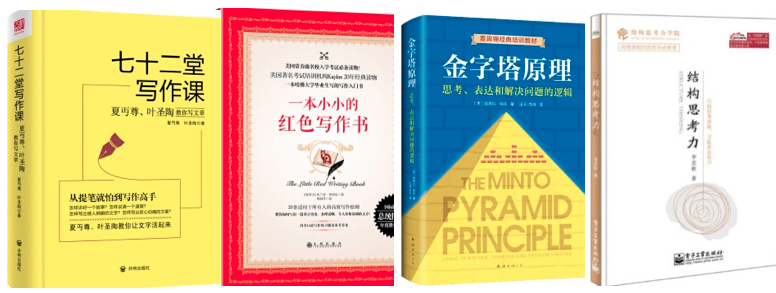

## 背景

看了很多写作技巧但是写作能力还是没有得到显著提升，下笔如有神还是理想状态，遥不可及。下笔还是很困难。那问题出在哪里呢？

其实，初阶写作者并不应该直接就来关注写作技巧，而是应该加大阅读并不断思考。写作就像娃娃学走路，应该先学会走，再学会跑。不要上来就想着跑，在前期花大量时间去学习写作技能。

<!-- more -->

## 写作技巧是能力增强

为了提高写作能力，看了N本写作相关的畅销书。在阅读完这几本书籍之后，发现自己写作能力并没有太大的提升。对这些书籍的内容进行了分析，发现这些书籍都是在讲有了文章大概内容之后：

- 如何将内容进行排列
- 如何将内容进行填充
- ......

可以看出，这些技能点都是锦上添花。下面是我看过的几本畅销书：

拿其中的两本，《金字塔原理》和《一本小小的红色写作书》的内容举例：

## 多阅读、多思考、多练习才是重中之重

### 多阅读积累素材

### 多思考输出有价值的观点

### 多练习培养肌肉记忆

1. 多练习可以降低心里预期。对于不敢干的事情，干之前各种犹豫。还不如先干了再说，干完了你会发现。其实也就那个样子，没有多夸张。